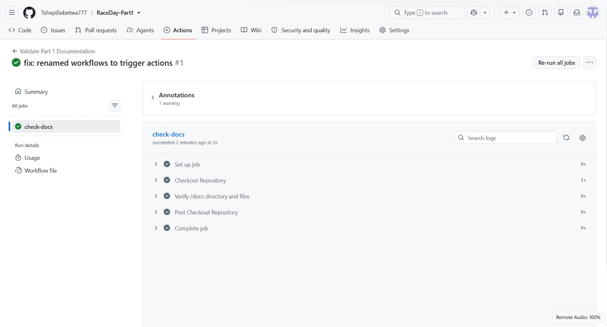

# RaceDay Event Management System
 
## System Description
South Africa hosts hundreds of iconic community walks, park runs, and charity cycling events every weekend. The RaceDay platform is a modernized, cloud-aware backend solution built to streamline the operations of these events. Moving away from spreadsheets, this platform manages user roles, event scheduling, sponsorships, category distances, and participant tracking. Part 1 focuses on designing a robust, normalized relational database and mapping out the RESTful API endpoints that will drive the frontend applications.
 
## User Roles
*   **Organiser:** The administrative role responsible for managing the lifecycle of an event. Organisers can create events, manage sponsor tiers, add distance categories, update event details, and publish the final timing and medal results.
*   **Participant:** The end-user role for athletes. Participants can register for an account, browse the calendar of events, securely enrol in race categories, and review their past achievements and finish times.
 
## Setup Instructions
To initialize the backend database for this project:
 
1. Clone this repository to your local machine.
2. Launch SQL Server Management Studio (SSMS).
3. Navigate to the `/docs/` folder and open the `RaceDayDB.sql` script.
4. Run the complete script to generate the `RaceDayDB` database. The script includes all primary keys, foreign key constraints, and sample seed data required for testing.
5. The system's API endpoints and database ERD can be reviewed in the `/docs` directory.
 
## Automated Workflow Status

 
 
## Walkthrough Video
[Insert Unlisted YouTube Video Link Here]